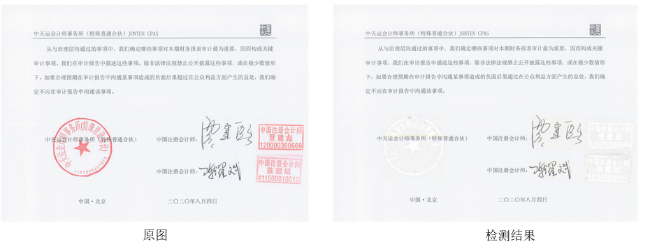
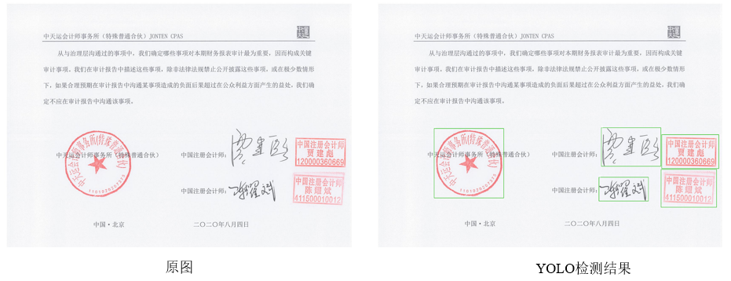
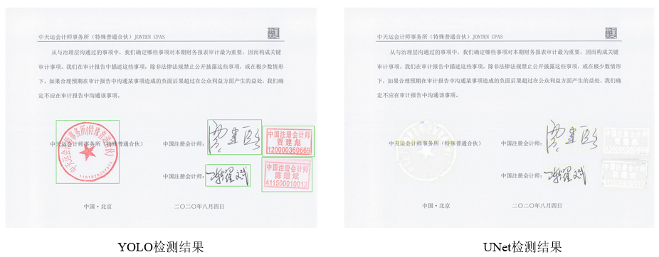
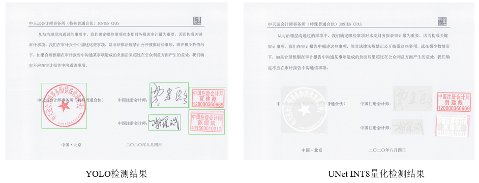

<div align="center">
    <br>
    <b><a>Seal Removal</a></b>
</div>

# 1. Real Removal (YOLOv5 + UNet)

本项目的目标是去除图像上的印章，后续可以用在OCR等任务中，对图像上的文字进行识别（相当于在ORC之前去掉图像中的噪声）。印章去除的主要思路是：首先使用YOLOv5目标检测算法识别图像中的印章，然后再使用UNet语义分割技术对印章进行去除。为了提高检测速度，使用TensorRT技术对YOLOv5和UNet算法进行加速。<br>

# 2. Requirements

TensorRT 7.2<br>
Cuda 11.1<br>
Python 3.7<br>
opencv 3.4<br>
cmake 3.18<br>

# 3. Preparation
请先阅读[YOLOv5](https://github.com/wang-xinyu/tensorrtx)和[UNet](https://github.com/oreo-lp/unet-tensorrt)项目的README文件，分别生成YOLOv5与Unet各自的engine，并将YOLOv5和UNet的engine文件放到本项目目录下。<br>


# 4. Inference
创建build文件夹，然后再build文件夹下进行编译，编译之后会在本文件夹下生成可执行文件。<br>
```
mkdir build
cd build
cmake ..
make
```

执行需要指定两个engine与图像文件夹。<br>
```
./seal_remove  ../yolov5m_fp16.engine ../unet_fp16.engine ../data
```

# 5. YOLOv5 results
下面是使用YOLOv5检测的结果。使用YOLOv5目标检测算法能够识别出图像中的印章，然后将该部分印章送入到UNet网络中，就能够恢复出没有印章的图像。使用FP32, FP16以及INT8的检测结果基本和下图相同，因此就不在单独一一呈现。
<div align="center">
    <br>
    <b><a>YOLOv5 detection</a></b>
</div>

# 6. UNet results
下面是使用UNet检测的结果。从YOLOv5的检测结果中，对印章部分进行印章去除修复。使用FP32和FP16的结果与下图基本相似。
<div align="center">
    <br>
    <b><a>YOLOv5 detection</a></b>
</div>
但是，对UNet使用INT8量化的修复结果不是很理想。
<div align="center">
    <br>
    <b><a>YOLOv5 detection</a></b>
</div>
其主要原因是在INT8量化的时候，使用int8数据来近似表示float 32位的数据，对于YOLOv5预测物体大致位置的任务而言，精度损失在可以接受的范围；但是对于UNet语义分割等像素级别的任务而言，INT8所带来的精度损失对该任务本身而言就非常严重了。因此，不推荐对语义分割等像素级别的任务使用INT8量化。

# 7. Efficiency
下面列出了加速后的时间损耗 (测试环境为：Tesla V100)

  | Python | FP32 | FP16 | INT8
  | ----- |----- | ------  | ------
  | 512x512 | 512x512 | 512x512 | 512x512
  | 48ms | 24ms  | 12ms  | 13ms

# 8. Reference
[1] https://github.com/wang-xinyu/tensorrtx </br>
[2] https://github.com/oreo-lp/unet-tensorrt
